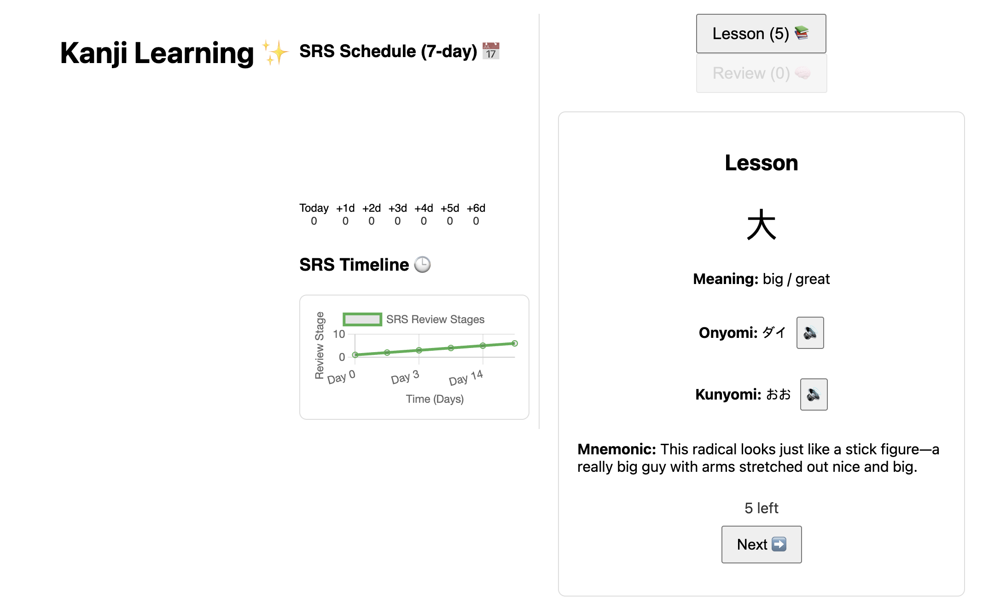
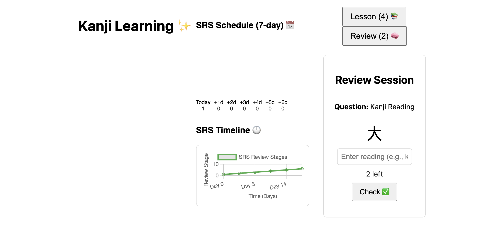

Kanji Learning Website
A React-based web application designed to help users learn and review Japanese Kanji characters using interactive lessons and a spaced repetition system (SRS). The app features a clean, centered UI with a dashboard for tracking progress, text-to-speech for pronunciations, and emoji-enhanced visuals for an engaging experience.
Features

Lesson Sessions: Learn new Kanji with their meanings, onyomi/kunyomi readings, and mnemonic stories. Includes text-to-speech buttons (🔊) for pronunciation.
Review Sessions: Review Kanji using SRS with questions on meanings and readings. Supports both onyomi and kunyomi for reading questions, with real-time feedback (✅/❌) after submitting answers via Enter or "Check" button.
SRS Dashboard: Visualize review schedules with a 7-day bar chart and timeline, updating in real-time as users progress.
User-Friendly UI: Centered layout with the dashboard on the side, emoji-enhanced buttons (📚, 🧠, ➡️), and red/green feedback for correct/incorrect answers.
Input Conversion: Automatically converts Romanji to Hiragana (e.g., "kou" to "コウ") for reading questions using the wanakana library.

Screenshots
(Add screenshots of the lesson session, review session, and dashboard here. Use tools like Snagit or browser developer tools to capture images, then upload to the screenshots/ folder and link them, e.g., )
Getting Started
Prerequisites

Node.js: Version 14 or higher (download).
Git: Installed for cloning the repository (download).
GitHub Account: For cloning and contributing (github.com).

Installation

Clone the Repository:
git clone https://github.com/ruthbutnotless/my-kanji-srs-app.git
cd kanji-learning-website

Install Dependencies:
npm install

This installs required packages, including react, wanakana, chart.js, and react-chartjs-2.

Run the Application:
npm start

The app will open at http://localhost:3000 in your browser.

## Screenshots

Project Structure
my-kanji-srs-app/
├── src/
│   ├── components/
│   │   ├── LessonSession.js      # Lesson session component
│   │   ├── ReviewSession.js      # Review session component
│   │   ├── Dashboard.js          # SRS dashboard component
│   ├── data/
│   │   ├── kanjiData.js          # Kanji data (meanings, readings, mnemonics)
│   ├── App.js                    # Main app component
│   ├── App.css                   # Main styles
│   ├── Dashboard.css             # Dashboard styles
│   ├── index.js                  # React entry point
├── public/
│   ├── index.html                # HTML template
├── package.json                  # Project dependencies and scripts
├── README.md                     # Project documentation

Usage

Start a Lesson:
Click the "Lesson" button (📚) to learn new Kanji (up to 5 daily).
View the Kanji, meaning, readings, and mnemonic, and listen to pronunciations (🔊).
Click "Next" (➡️) to proceed. The count (e.g., "5 left") updates above the button.

Start a Review:
Click the "Review" button (🧠) to review learned Kanji.
Answer meaning or reading questions, with feedback (✅/❌) after pressing Enter or "Check".
Click "Next" (➡️) for the next question. The count (e.g., "X left") updates above the buttons.

Track Progress:
The dashboard on the side shows a 7-day SRS schedule and timeline, updating as you complete lessons and reviews.

Dependencies

React: Front-end framework for building the UI.
wanakana: Converts Romanji to Hiragana for reading inputs.
chart.js & react-chartjs-2: Renders the SRS dashboard charts.
Web Speech API: Provides text-to-speech for Kanji readings.

Fork the repository.
Create a feature branch (git checkout -b feature/your-feature).
Commit your changes (git commit -m "Add your feature").
Push to the branch (git push origin feature/your-feature).
Open a pull request.

Built with React and Create React App.
Inspired by spaced repetition systems like Anki.
Emojis add a fun, engaging touch to the learning experience (✨📚🧠).

# kanji-srs-app
